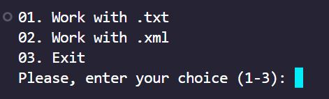
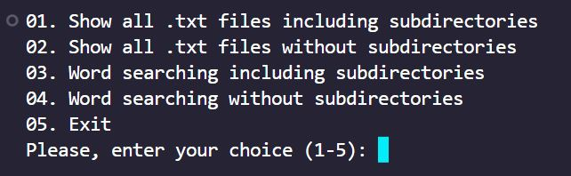
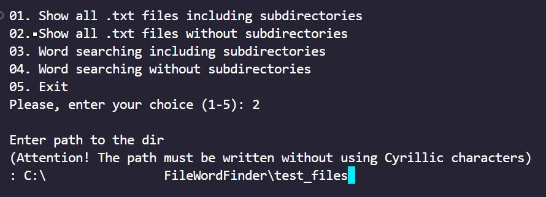
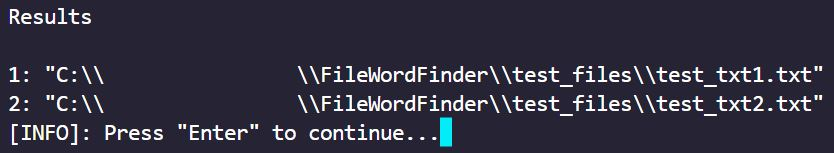
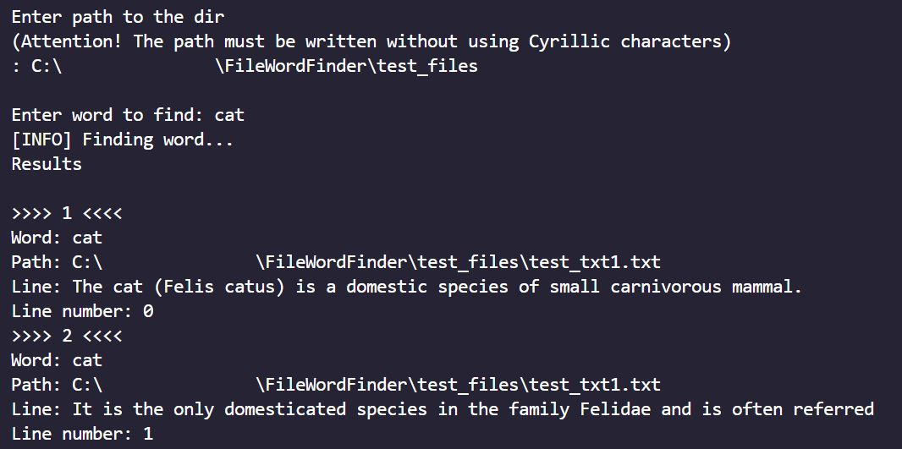

<!-- 
    Original template: 
    https://github.com/othneildrew/Best-README-Template/blob/master/README.md
-->

<a id="readme-top"></a>

<br />
<div align="center">
  <h3 align="center">Word finder</h3>

  <p align="center">
    Will help you to find word in directory
    <br />
    <br />
    <a href="https://github.com/Ptyg/FileWordFinder">Code</a>
    |
    <a href="https://github.com/Ptyg/FileWordFinder/pulls">Request Feature</a>
  </p>
</div>

<p align="center">
</p>

<details>
  <summary>Table of Contents</summary>
  <ol>
    <li>
      <a href="#about-the-project">About The Project</a>
      <ul>
        <li><a href="#built-with">Built With</a></li>
      </ul>
    </li>
    <li>
      <a href="#getting-started">Getting Started</a>
      <ul>
        <li><a href="#prerequisites">Prerequisites</a></li>
        <li><a href="#installation">Installation</a></li>
      </ul>
    </li>
    <li><a href="#usage">Usage</a></li>
    <li><a href="#contributing">Contributing</a></li>
    <li><a href="#license">License</a></li>
    <li><a href="#contact">Contact</a></li>
  </ol>
</details>

## About The Project

Utility that helps with finding word in directory.

<p align="right">(<a href="#readme-top">back to top</a>)</p>

### Built With

* [![C++][cpp-shield]][cpp-url]
* [![Cmake][cmake-shield]][cmake-url]

<p align="right">(<a href="#readme-top">back to top</a>)</p>

## Getting Started

### Prerequisites

You need to have:

* Git: https://git-scm.com/download/
* Cmake: https://cmake.org/download/

And next system envs:

* [ _or_ ] PATH - `{ path/to/clang/bin/ }`
* [ _or_ ] PATH - `{ path/to/msvc/bin/ }`
* PATH - `{ path/to/cmake/bin }`

### Installation

1. Create an empty directory wherever you want. It`s for repo cloning.

2. Clone the repo.

   ```sh
   git clone https://github.com/Ptyg/FileWordFinder.git
   ```

3. Open directory with cloned project in console.
    
    3.1 Type ... 
    ```sh
    cmake --list-presets
    ```

    ... to see all available presets. It is gonna looks like ...
    
    ```sh
    "preset_name#1" - preset_display_name#1
    "preset_name#2" - preset_display_name#2
    "preset_name#3" - preset_display_name#3 
    ...
    ```
    3.2 Choose a preset and type ...
    ```sh
    cmake --preset preset_name#1 (or cmake --preset preset_name#2, etc)
    ```

    3.3 Wait until project generation is done. Result will be located at `./out/build/{ preset_name }`

<p align="right">(<a href="#readme-top">back to top</a>)</p>

## Usage

- After launch, you`ll see a window like this



- For example, i want to work with txt files



- And want to list all files in directory. So i need to pass a path



- And result will be like this



- Or, I want to find a word, but can't remember which file it's in. So the result will be



<p align="right">(<a href="#readme-top">back to top</a>)</p>

## Contributing

If you have a suggestion that would make this better, please fork the repo and create a pull request.


1. Fork the Project
2. Create your Feature Branch (`git checkout -b { branch_name }`)
3. Commit your Changes (`git commit -m 'Add an amazing feature'`)
4. Push to the Branch (`git push origin { branch_name }`)
5. Open a Pull Request

<p align="right">(<a href="#readme-top">back to top</a>)</p>

## License

Distributed under the MIT License. See `LICENSE.txt` for more information.

<p align="right">(<a href="#readme-top">back to top</a>)</p>

## Contact

Gtyp - gtyp_local@proton.me

Project Link: [https://github.com/Ptyg/FileWordFinder](https://github.com/Ptyg/FileWordFinder)

<p align="right">(<a href="#readme-top">back to top</a>)</p>

<!-- VARIABLES -->
[cpp-shield]: https://img.shields.io/static/v1?message=v%2020&color=blue&logo=C%2B%2B&logoColor=blue&label=C%2B%2B
[cpp-url]: https://en.cppreference.com/w/cpp/20

[cmake-shield]: https://img.shields.io/static/v1?message=v%203.25.1&color=7d8580&logo=cmake&logoColor=7d8580&label=Cmake
[cmake-url]: https://cmake.org/